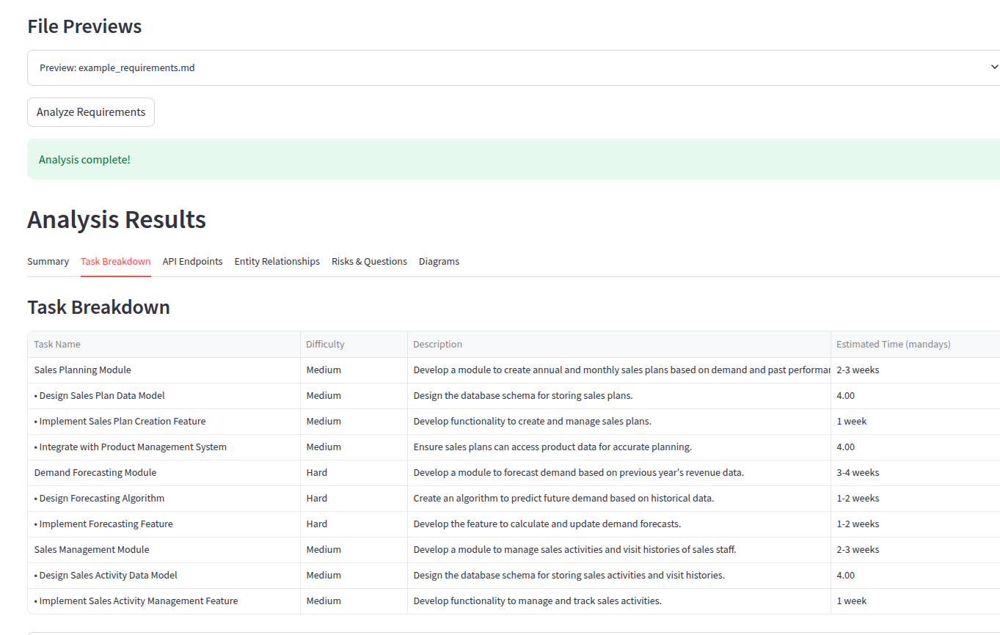
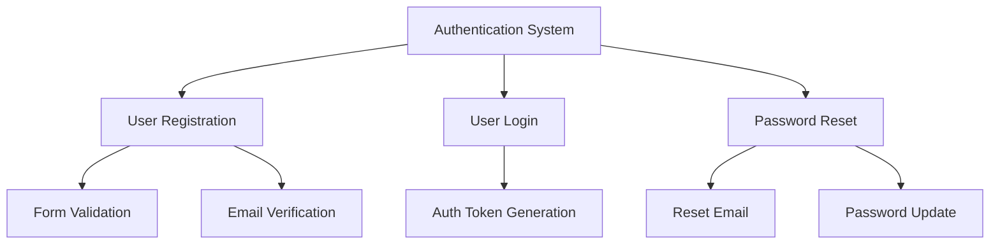
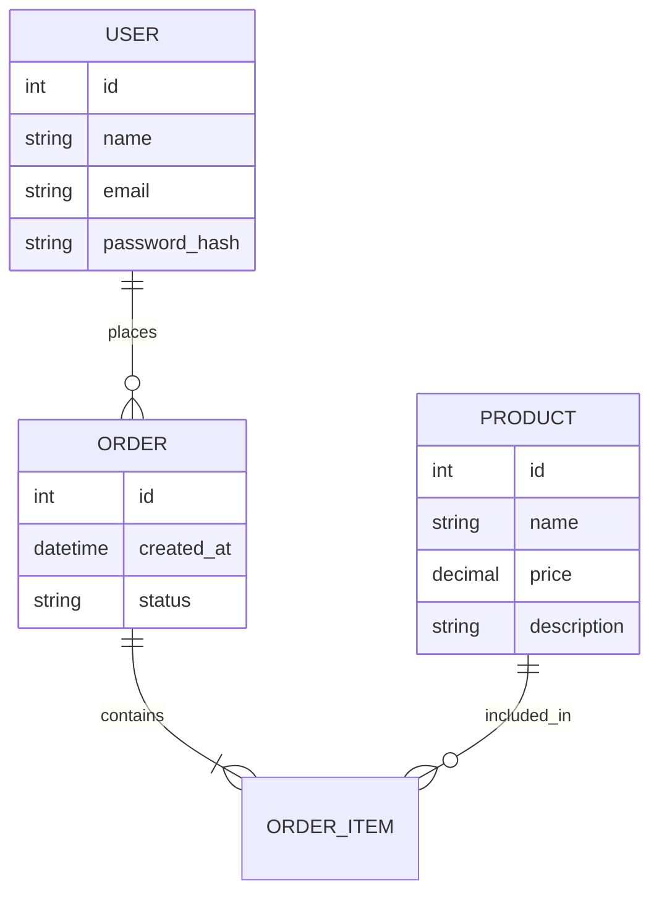

# Software Estimation App

A tool to help developers create better estimations for software projects by analyzing requirements, breaking down tasks, and visualizing relationships.




## Features

- Analyze software requirements from text or markdown files
- Identify software entities (products, orders, users, etc.)
- Break down tasks into hierarchical parent-child relationships
- Generate time estimates for each task
- Create Mermaid diagrams for task hierarchy and entity relationships
- Analyze API endpoints needed for implementation
- Identify potential risks and considerations

## Installation

```bash
# Clone the repository
git clone <repository-url>
cd est_app

# Install dependencies
pip install -e .
```

## Usage

### Command Line Interface

```bash
# Set your OpenAI API key
export OPENAI_API_KEY="your-api-key"

# Analyze from text
python -m est_egg.cli analyze-text --text "Implement a user authentication system with registration, login, and password reset."

# Analyze from markdown file
python -m est_egg.cli analyze-file --file /path/to/requirements.md
```

### Python API

```python
from est_egg import SoftwareAnalystAgent

# Initialize the agent
agent = SoftwareAnalystAgent()

# Analyze from text
result = agent.analyze_from_text("Implement a product catalog with categories and search functionality.")
agent.print_analysis_results(result)

# Analyze from markdown file
result = agent.analyze_from_markdown("/path/to/requirements.md")
agent.print_analysis_results(result)
```

## Example Output

The tool will generate:

1. A summary of the requirement
2. Hierarchical task breakdown with time estimates
3. API endpoint analysis
4. Entity relationship analysis
5. Mermaid diagrams for visualization
6. Potential risks and considerations

## Mermaid Diagram Examples

The generated Mermaid diagrams can be rendered in tools like GitHub, GitLab, or the Mermaid Live Editor.

### Task Hierarchy Example



### Entity Relationship Example


