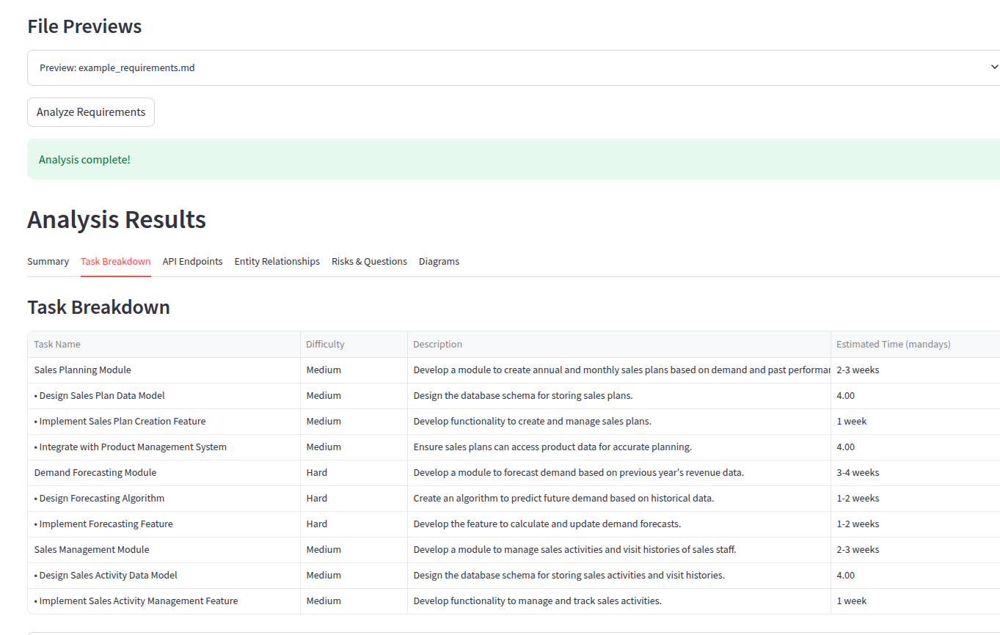
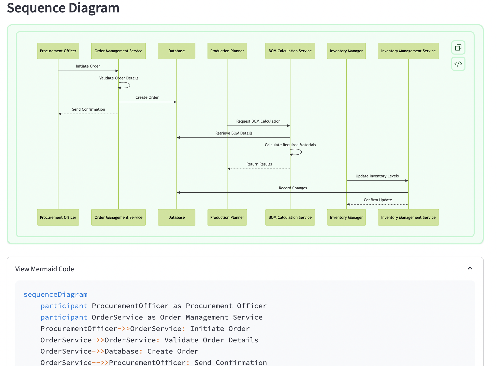
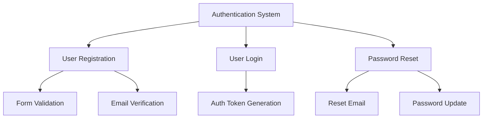
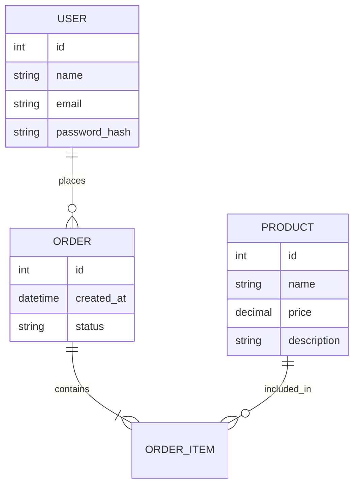

# Software Estimation App

A tool to help developers create better estimations for software projects by analyzing requirements, breaking down tasks, and visualizing relationships.






## Features

- Analyze software requirements from text or markdown files
- Identify software entities (products, orders, users, etc.)
- Break down tasks into hierarchical parent-child relationships
- Generate time estimates for each task
- Create Mermaid diagrams for task hierarchy and entity relationships
- Analyze API endpoints needed for implementation
- Identify potential risks and considerations

## Installation

```bash
# Clone the repository
git clone <repository-url>

# Install dependencies
pip install -e .
```

## Setting env

- Set environment variables in `.env` file
```
export OPENAI_API_KEY="your-api-key"
DB_CHROMA_PATH=./data/chroma
DB_SQLITE_PATH=./data/db.sqlite3
```

## Usage

### Run application streamlit

```
python run_app.py
```

## Example Output

The tool will generate:

1. A summary of the requirement
2. Hierarchical task breakdown with time estimates
3. API endpoint analysis
4. Entity relationship analysis
5. Mermaid diagrams for visualization
6. Potential risks and considerations

## Mermaid Diagram Examples

The generated Mermaid diagrams can be rendered in tools like GitHub, GitLab, or the Mermaid Live Editor.

### Task Hierarchy Example



### Entity Relationship Example


